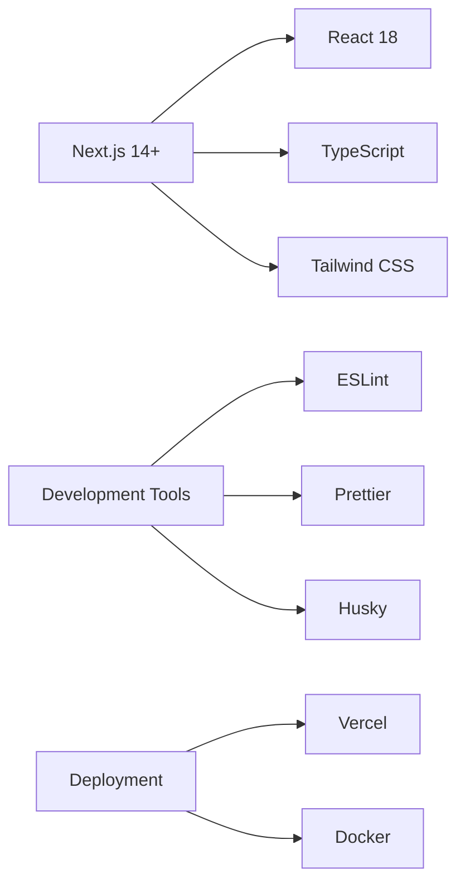

<div align="center">

# 🚀 Next.js Production-Level Setup

[](https://nextjs.org/)
[](https://www.typescriptlang.org/)
[](https://tailwindcss.com/)
[](LICENSE)

**A comprehensive, production-ready Next.js boilerplate with enterprise-grade configurations, modern tooling, and industry best practices.**

[Features](#-features) • [Quick Start](#-quick-start) • [Documentation](#-documentation) • [Contributing](#-contributing)

---

</div>

## 📋 Table of Contents

- [Overview](#-overview)
- [Features](#-features)
- [Tech Stack](#-tech-stack)
- [Prerequisites](#-prerequisites)
- [Quick Start](#-quick-start)
- [Project Structure](#-project-structure)
- [Development Workflow](#-development-workflow)
- [Code Quality](#-code-quality--formatting)
- [Testing](#-testing)
- [Deployment](#-deployment)
- [Configuration](#-configuration)
- [Contributing](#-contributing)
- [License](#-license)

---

## 🎯 Overview

This repository provides a **battle-tested Next.js starter template** optimized for production environments. It combines the latest web technologies with proven architectural patterns to accelerate your development workflow.

### Why Choose This Setup?

| Benefit | Description |
|---------|-------------|
| ⚡ **Lightning Fast** | Optimized build configurations and performance best practices |
| 🔒 **Type-Safe** | Full TypeScript integration with strict mode enabled |
| 🎨 **Modern Stack** | Latest versions of Next.js, React, and ecosystem tools |
| 🛡️ **Quality Gates** | Pre-commit hooks ensure code quality before it reaches your repo |
| 📦 **Scalable Architecture** | Organized structure that grows with your application |
| 🚀 **Deploy Ready** | Configured for Vercel, Docker, and major cloud providers |

---

## ✨ Features

### Core Functionality
- ✅ **Next.js 14+ with App Router** - Modern React framework with cutting-edge features
- ✅ **TypeScript Configuration** - Strict type checking for robust codebases
- ✅ **Tailwind CSS** - Utility-first styling with custom configuration
- ✅ **ESLint & Prettier** - Automated code quality and formatting
- ✅ **Path Aliases** - Clean imports with `@/` prefix

### Developer Experience
- 🎯 **Husky Git Hooks** - Pre-commit validation prevents bad code
- 🔍 **lint-staged** - Lightning-fast checks on only changed files
- 📝 **Smart Formatting** - Prettier with Tailwind class sorting
- 🔄 **Hot Module Replacement** - Instant feedback during development
- 🛠️ **Comprehensive Scripts** - Streamlined development commands

### Production Optimizations
- 🚀 **Optimized Builds** - Tree-shaking and code splitting out of the box
- 📊 **Bundle Analysis** - Understand your application's size
- 🔐 **Environment Variables** - Secure configuration management
- 📱 **Responsive Design** - Mobile-first approach built-in
- ⚡ **Performance Monitoring** - Web Vitals tracking ready

---

## 🛠 Tech Stack



### Core Technologies
- **Framework**: Next.js 14+ (App Router)
- **Language**: TypeScript 5.0+
- **Styling**: Tailwind CSS 3.0+
- **Package Manager**: npm / yarn / pnpm

### Development Tools
- **Code Quality**: ESLint with Next.js config
- **Formatting**: Prettier with Tailwind plugin
- **Git Hooks**: Husky + lint-staged
- **Testing**: Jest + React Testing Library (optional)

---

## 📋 Prerequisites

Before you begin, ensure you have the following installed:

| Tool | Version | Purpose |
|------|---------|---------|
| **Node.js** | v18.0.0+ | JavaScript runtime |
| **npm** | v9.0.0+ | Package management |
| **Git** | v2.0.0+ | Version control |

### Recommended VS Code Extensions
- ESLint
- Prettier - Code formatter
- Tailwind CSS IntelliSense
- GitLens
- Error Lens

---

## 🚀 Quick Start

Get up and running in under 2 minutes:

### 1️⃣ Clone the Repository

```bash
git clone https://github.com/SidharthSinghShrinet/NextJS_Setup_Production_Level.git
cd NextJS_Setup_Production_Level
```

### 2️⃣ Install Dependencies

```bash
npm install
# or
yarn install
# or
pnpm install
```

### 3️⃣ Start Development Server

```bash
npm run dev
# or
yarn dev
# or
pnpm dev
```

### 4️⃣ Open Your Browser

Navigate to [http://localhost:3000](http://localhost:3000) and start building! 🎉

---

## 📁 Project Structure

```
NextJS_Setup_Production_Level/
│
├── 📁 .husky/                  # Git hooks configuration
│   └── pre-commit              # Pre-commit validation script
│
├── 📁 app/                     # Next.js App Router directory
│   ├── layout.tsx             # Root layout component
│   ├── page.tsx               # Home page component
│   ├── globals.css            # Global styles
│   └── api/                   # API routes (optional)
│
├── 📁 public/                  # Static assets
│   ├── images/                # Image files
│   └── fonts/                 # Font files
│
├── 📁 components/              # Reusable React components (optional)
│   ├── common/                # Shared components
│   └── ui/                    # UI components
│
├── 📄 .eslintrc.json          # ESLint configuration
├── 📄 .lintstagedrc.js        # lint-staged configuration
├── 📄 .prettierrc             # Prettier configuration
├── 📄 .prettierignore         # Files to ignore for Prettier
├── 📄 jsconfig.json           # Path aliases configuration
├── 📄 next.config.mjs         # Next.js configuration
├── 📄 package.json            # Dependencies and scripts
├── 📄 tailwind.config.js      # Tailwind CSS configuration
└── 📄 README.md               # This file
```

---

## 💻 Development Workflow

### Available Scripts

| Script | Command | Description |
|--------|---------|-------------|
| **Development** | `npm run dev` | Start development server on port 3000 |
| **Build** | `npm run build` | Create optimized production build |
| **Production** | `npm run start` | Start production server |
| **Lint** | `npm run lint` | Check code with ESLint |
| **Lint Fix** | `npm run lint:fix` | Auto-fix ESLint issues |
| **Format** | `npm run format` | Format code with Prettier |
| **Staged** | `npm run lint:staged` | Run pre-commit checks manually |

### Development Commands

```bash
# Start development with hot reload
npm run dev

# Build and test production bundle locally
npm run build && npm run start

# Check for linting issues
npm run lint

# Automatically fix linting issues
npm run lint:fix

# Format all files with Prettier
npm run format
```

---

## 🧹 Code Quality & Formatting

This setup enforces code quality through multiple layers:

### 🔍 ESLint Configuration

**What it checks:**
- ✅ No unused variables or imports
- ✅ Proper React Hooks usage
- ✅ Next.js best practices
- ✅ Accessibility rules
- ✅ TypeScript type safety

**Run checks:**
```bash
# Check for issues
npm run lint

# Auto-fix issues
npm run lint:fix
```

### ✨ Prettier Formatting

**What it formats:**
- ✅ Consistent indentation and spacing
- ✅ Automatic semicolon management
- ✅ Quote style normalization
- ✅ Tailwind class sorting (via plugin)

**Run formatting:**
```bash
npm run format
```

### 🔄 Pre-commit Automation (Husky + lint-staged)

Every commit automatically triggers:

```bash
git add .
git commit -m "feat: add amazing feature"
```

**What happens:**
1. 🔍 ESLint runs on staged `.js`, `.jsx`, `.ts`, `.tsx` files
2. ✨ Prettier formats staged files
3. ✅ Only valid code is committed
4. ❌ Commit is blocked if issues are found

This ensures your `main` branch stays clean and production-ready!

---

## 🧪 Testing

### Setting Up Tests (Optional)

This template is test-ready. To add testing:

```bash
npm install --save-dev jest @testing-library/react @testing-library/jest-dom
```

### Example Test Structure

```javascript
// __tests__/components/Button.test.tsx
import { render, screen } from '@testing-library/react';
import Button from '@/components/Button';

describe('Button Component', () => {
  it('renders correctly', () => {
    render(<Button>Click me</Button>);
    expect(screen.getByText('Click me')).toBeInTheDocument();
  });
});
```

---

## 🚢 Deployment

### Deploying to Vercel (Recommended)

The easiest deployment path for Next.js:

1. Push your code to GitHub
2. Visit [vercel.com](https://vercel.com)
3. Import your repository
4. Configure environment variables
5. Click **Deploy** ✨

[](https://vercel.com/new)

### Docker Deployment

Create a `Dockerfile` in your project root:

```dockerfile
FROM node:18-alpine AS base

WORKDIR /app
COPY package*.json ./
RUN npm ci
COPY . .
RUN npm run build

EXPOSE 3000
CMD ["npm", "start"]
```

**Build and run:**
```bash
docker build -t nextjs-app .
docker run -p 3000:3000 nextjs-app
```

### Other Platforms
- **Netlify**: See [Next.js on Netlify](https://docs.netlify.com/integrations/frameworks/next-js/)
- **AWS**: Use AWS Amplify or EC2 with PM2
- **Railway**: One-click deployment available

---

## ⚙️ Configuration

### Environment Variables

Create a `.env.local` file:

```env
# Application
NEXT_PUBLIC_APP_URL=http://localhost:3000

# API
NEXT_PUBLIC_API_URL=https://api.example.com

# Analytics (optional)
NEXT_PUBLIC_GA_ID=G-XXXXXXXXXX
```

> **Note**: Variables prefixed with `NEXT_PUBLIC_` are exposed to the browser.

### Tailwind Customization

Edit `tailwind.config.js`:

```javascript
module.exports = {
  content: [
    './app/**/*.{js,ts,jsx,tsx}',
    './components/**/*.{js,ts,jsx,tsx}',
  ],
  theme: {
    extend: {
      colors: {
        brand: {
          50: '#f0f9ff',
          500: '#0ea5e9',
          900: '#0c4a6e',
        },
      },
    },
  },
  plugins: [],
};
```

### Path Aliases

Configure in `jsconfig.json` or `tsconfig.json`:

```json
{
  "compilerOptions": {
    "paths": {
      "@/*": ["./*"],
      "@components/*": ["./components/*"],
      "@lib/*": ["./lib/*"]
    }
  }
}
```

---

## 🤝 Contributing

We welcome contributions from the community! Here's how you can help:

### How to Contribute

1. **Fork** this repository
2. **Create** a feature branch (`git checkout -b feature/amazing-feature`)
3. **Commit** your changes (`git commit -m 'feat: add amazing feature'`)
4. **Push** to the branch (`git push origin feature/amazing-feature`)
5. **Open** a Pull Request

### Contribution Guidelines

- ✅ Follow the existing code style
- ✅ Write clear commit messages
- ✅ Add tests for new features
- ✅ Update documentation as needed
- ✅ Ensure all checks pass before submitting

### Commit Message Convention

We follow [Conventional Commits](https://www.conventionalcommits.org/):

- `feat:` New features
- `fix:` Bug fixes
- `docs:` Documentation changes
- `style:` Code style changes (formatting)
- `refactor:` Code refactoring
- `test:` Adding tests
- `chore:` Maintenance tasks

---

## 📚 Resources

### Official Documentation
- [Next.js Documentation](https://nextjs.org/docs)
- [React Documentation](https://react.dev)
- [Tailwind CSS Documentation](https://tailwindcss.com/docs)
- [TypeScript Documentation](https://www.typescriptlang.org/docs)

### Helpful Guides
- [Next.js Production Checklist](https://nextjs.org/docs/pages/building-your-application/deploying/production-checklist)
- [App Router Guide](https://nextjs.org/docs/app)
- [Tailwind Best Practices](https://tailwindcss.com/docs/reusing-styles)

---

## 📄 License

This project is licensed under the **MIT License** - see the [LICENSE](LICENSE) file for details.

You are free to use, modify, and distribute this code in your projects!

---

## 🙏 Acknowledgments

Special thanks to:
- The Next.js team for an incredible framework
- The open-source community for inspiration
- All contributors who help improve this template

---

<div align="center">

### 💡 Have Questions?

📧 **Email**: [Contact Maintainer](mailto:sidharthsinghshrinet@example.com)  
🐛 **Issues**: [GitHub Issues](https://github.com/SidharthSinghShrinet/NextJS_Setup_Production_Level/issues)  
💬 **Discussions**: [GitHub Discussions](https://github.com/SidharthSinghShrinet/NextJS_Setup_Production_Level/discussions)

---

**Made with ❤️ by [SidharthSinghShrinet](https://github.com/SidharthSinghShrinet)**

⭐ **If you found this helpful, please consider giving it a star!** ⭐

[⬆ Back to top](#-nextjs-production-level-setup)

</div>
